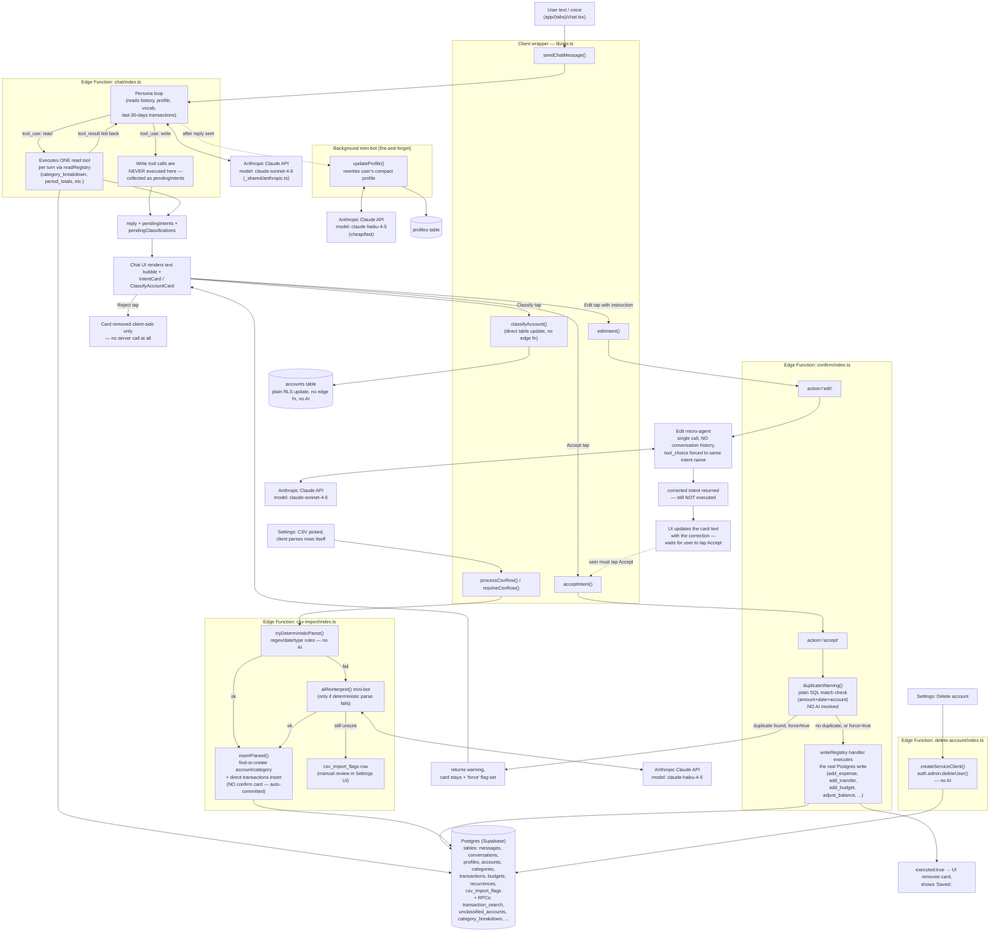

# Data Flow — as literally implemented today

This traces the real code paths: [app/(tabs)/chat.tsx](app/(tabs)/chat.tsx) → [lib/api.ts](lib/api.ts) → Supabase Edge Functions → Anthropic Claude API → Postgres. Nothing here is aspirational — every box/arrow corresponds to a line of code found while reading the repo.

## Plain-language legend

- **Mini-bots** = the 3 separate, narrow Claude calls outside the main chat loop: the background **memory writer** (rewrites your profile after every chat turn, Haiku, cheap), the **edit micro-agent** (fixes a single pending card when you tap Edit, Sonnet, no memory of the conversation), and the **CSV AI fallback** (only fires when a spreadsheet row can't be parsed by plain rules, Haiku).
- **The main persona** (in `chat/index.ts`) is one Claude call (Sonnet) that can both look things up (reads, executed immediately) and propose changes (writes, *never* executed immediately — always turned into a card).
- **The confirm loop** is the only place an actual database write happens: `confirm/index.ts`, action `accept`. Reject never even reaches the server. Edit calls a mini-bot to patch the card text, then waits for the user to tap Accept on the patched version (no auto-accept).
- **Things that bypass AI entirely**: classifying an account's type, deleting all your data, deleting your account, and the deterministic half of CSV import — these are plain Supabase table calls, no Claude involved.
- **Duplicate detection** before a write is a plain SQL exact-match check, not AI judgment.
